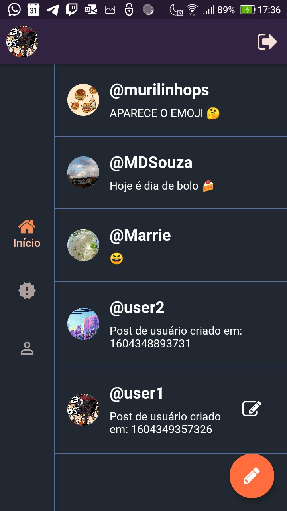
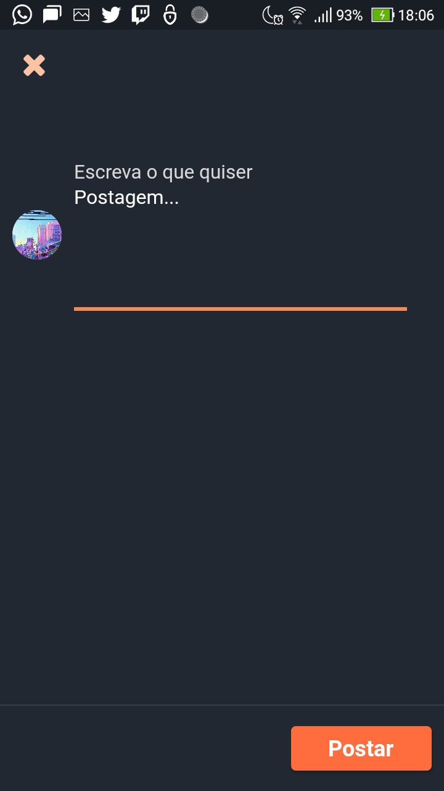

# Challenge_bt_app (like twitter)

A Flutter project simulating a blogging app to share ideas and thoughts. It's a basic app that I used twitter as base and added my custom "flavors", another navigation method  and I used halloween colors palletes. 

  

_______________________________________________________________________________________________________________________________________

 

_________________________________________________________________________________________________________________________________________

## In this project

1. I used Getx as the core of the application for dependency, routes and state management
2. Divide the app into global folder, to use in the entirely application and divided into modules
3. Inside every modules are the controllers and the dependencies it will use, is inside modules folder
4. I'm testing how to use navigation rails globally, so might some navigation bugs
5. [All screenshots](https://drive.google.com/drive/folders/1q431utHZhuIxPOy3M26JxTUMPIcidxem?usp=sharing)
6. The build is in the dist folder, it's an apk
7. Thanks!

### Back-end
I made the rest api that I'm consuming in the app. I added authentication with JWT and refresh tokens, added postgreesql in heroku with users_tables, image for profile image and posts table. I made using nodeJs with typescript, here is the repository: https://github.com/murilinhoPs/auth_back_ts.

1. There some things I need to fix in the back-end, like the profile images that disapear from the api after some time, because heroku sleeps and clean the folder. I'm going to put the images in the google cloud.
2. Might be another error or another, but feel free to take a look. Thanks!

#### Getting Started
This project is a starting point for a Flutter application.

A few resources to get you started if this is your first Flutter project:

- [Lab: Write your first Flutter app](https://flutter.dev/docs/get-started/codelab)
- [Cookbook: Useful Flutter samples](https://flutter.dev/docs/cookbook)

For help getting started with Flutter, view our
[online documentation](https://flutter.dev/docs), which offers tutorials,
samples, guidance on mobile development, and a full API ref
